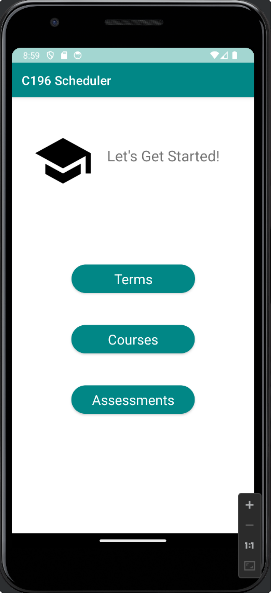

# C196 Course Scheduling App
Created for Mobile App Development (WGU class C196)

<a href="Screen_Menu_Storyboard.png">View app storyboard</a>

  

## Description:
This Android mobile application helps students track their academic progress by organizing terms, courses, and assessments. Users can add, edit, and delete entries for terms, courses, and assessments while receiving alerts for important deadlines. The app is designed for Android 8.0 and above and includes various features to ensure efficient progress tracking and management.

## Key Features:
- **Terms Management**: Add, edit, and delete terms, including start and end dates.
- **Course Management**: Associate courses with terms, manage details like instructor info, status, and receive alerts for course dates.
- **Assessment Tracking**: Track performance and objective assessments for each course, with reminders for assessment deadlines.
- **SQLite Database**: All data is stored locally using SQLite for offline access.
- **Notifications & Alerts**: Stay on top of deadlines with notifications for important course and assessment dates.
- **Share Notes**: Easily share course notes via email or SMS.
- **User-Friendly Interface**: Includes vertical scrolling, action bar, buttons, and responsive layouts for portrait and landscape modes.

## Technical Details:
- **Compatible with Android 8.0+**.
- **Database**: SQLite for storing term, course, and assessment data.
- **Scheduler**: Implemented using an ArrayList, intent, and activity-based navigation across multiple screens.
- **Deployment**: The application is packaged as a signed APK for easy installation.

## Challenges & Reflections:
- [Insert reflections on development, challenges, and improvements here.]

## Future Enhancements:
- [Insert future ideas, such as tablet support or additional features.]
